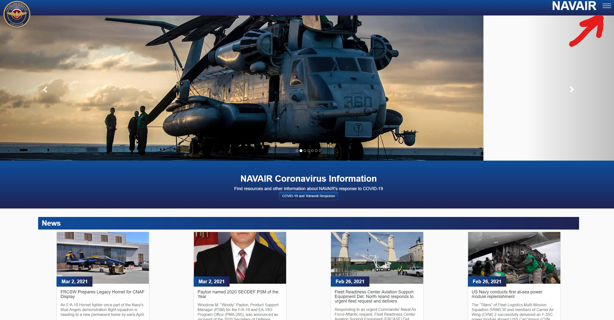
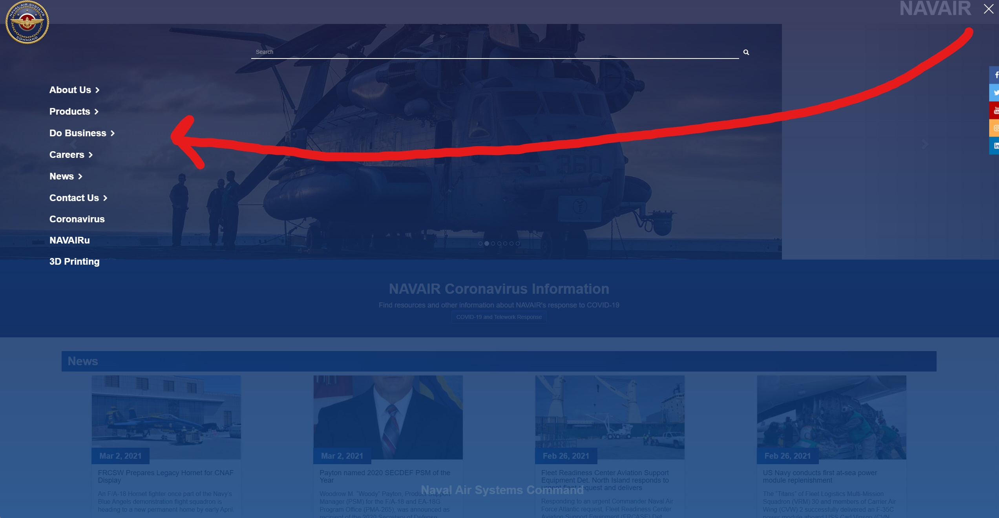
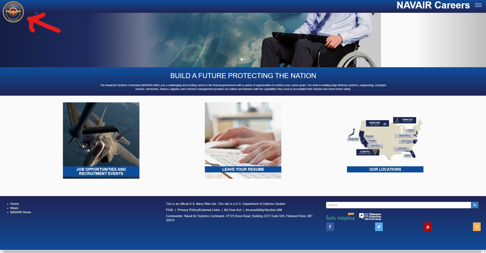
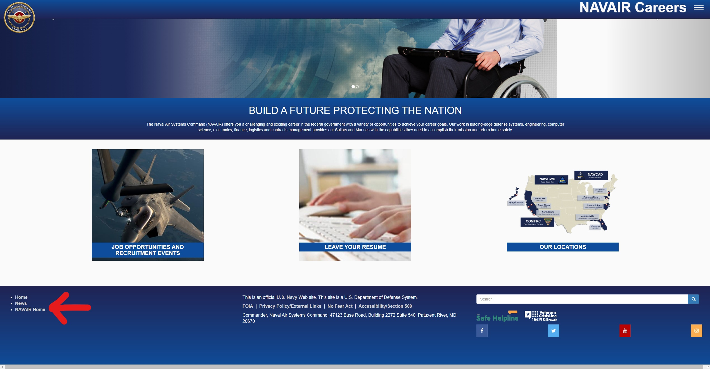

# Confusion on Navair's Website
## By Curtis Figgins 3/4/21

I'm confident with my ability to use and learn new technology. As a computer science student who has 
being using computers for over a decade, I am experienced navigating websites and have got used to 
how developers often layout the UI and navigation for their websites. Navair changed how I expected some 
of these things to function.

What brought me to Navair's website in the first place was to learn about their company because they 
would be attending Chico State's Technical Career Fair. My goal was to learn more about them and the careers
that they offer. 

My first inclination when getting to the website was to look for some sort of menu at the top of the page. 
Typically I see a menu in the top left of webpages but Navair chose to put it in the right with a hamburger 
button.

When clicking on the menu button I expected it to drop down with my choices below it. However, the choices 
were displayed on the opposite side of the screen where I originally would have expected the menu to be 
in the first place. This made me more puzzled to why they chose to put the menu in the right corner. 
Next I chose to go to the career page for civilians. 

Like the homepage they used a hamburger menu in the corner but this time with different options than the original menu. 
After doing some research I wanted to go back to the homepage. From experience, normally the company or website's 
icon/symbol takes you back to the homepage so I clicked on that.

This only took me back to the career homepage which was not what I wanted. I tried the menu to see if I could get back to 
the navair homepage from there but no luck as well. The only way I ended up finding out how to get back without pressing the web browser
back button was to click on a little link in the bottom left corner that said "NAVAIR home". It didn't help that
I had to scroll down the page to find it. 

I feel that there were several goals of usability that Navair didn't take into consideration when creating their website. One of them
is **Satisfying**. This would be if the website is enjoyable to use. The website isn't very visually appealing which is a problem
I see with a lot of government websites. The website at times left me confused or frustrated by the decisions they made when creating the website. 
It just didn't feel good to use and left me with a negative experience. Another goal that they failed to meet was **efficiency**. This would be if 
it didn't take much effort to reach your goal on the website. It shouldn't take the user multiple tries to get back to the homepage. I also ran into 
situations where I had to go through many links to get the info I wanted. 
