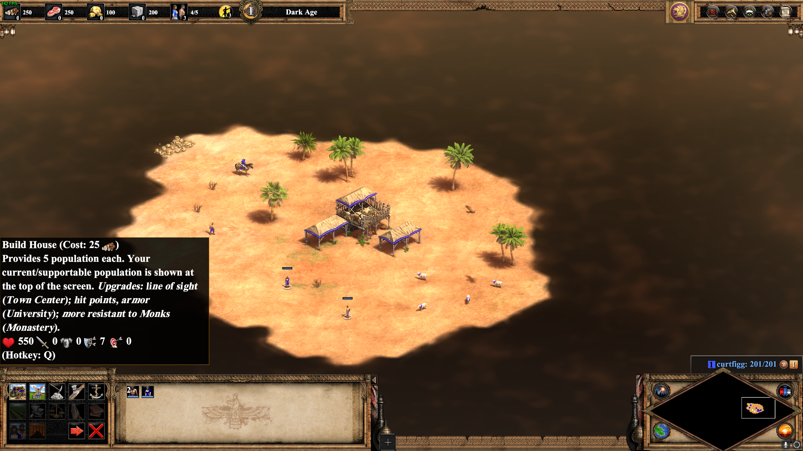

# Learning to play Age of Empires
## By Curtis Figgins 4/25/21

Age of Empires 2 is a strategy game where you compete with other players to build your civilizations while attacking your opponents to defeat them. Each player starts out with a few villagers and a town center and have to gather resources to make new villagers and buildings. 

When you click on a villager, you can see the buildings they can build in the bottom left corner. 

As you can see in the picture, there are icons the represent the different buildings you can create. When you highlight over them it also gives a description of what they do. This also applies to making military units; they get a description of what they do and of their strengths and weaknessses. This is an example of how the developers do a good job at increasing the game's **learnability**. The game uses icons to represent most things which is a good way to get an idea of what they might do. 

As you create more villagers you need to put them on different resources to make sure you have enough to build buildings and purchase upgrades. You need to make sure you have a balanced economy so you aren't running out of any specific resource. 

The more villagers you create, the more you can grow your economy. This also means you have more to manage. While the developers did a good job at making the different buttons and actions **learnable**, learning to properly manage your villagers will take lots of practice. In order to get good at the game, you need to make sure that you never have any villagers standing idle. They should always be building or gathering resources. This gets very difficult when you have dozens of villagers and are trying to manage an army at the same time. 

